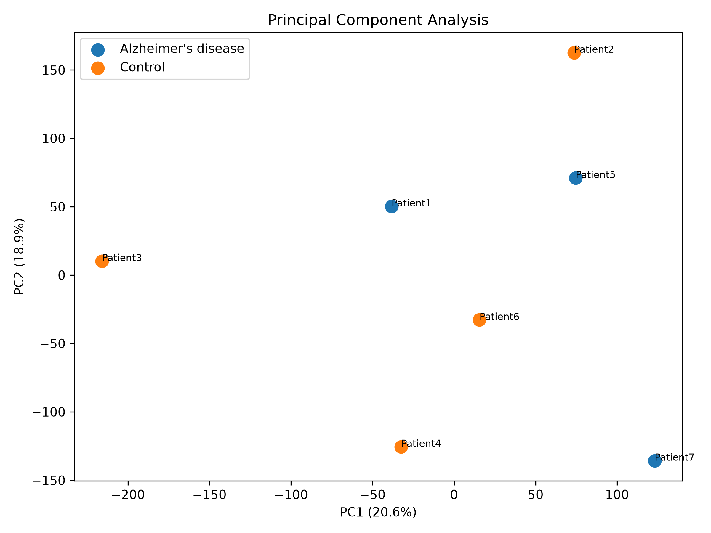
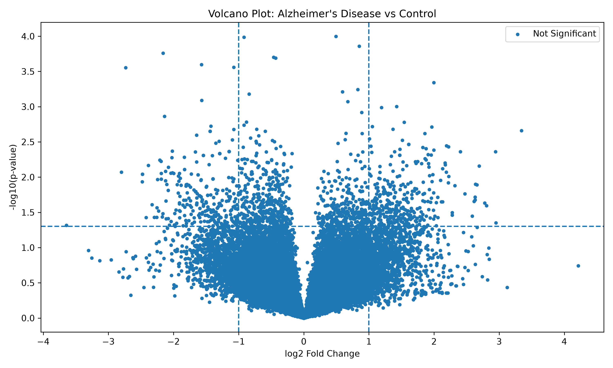
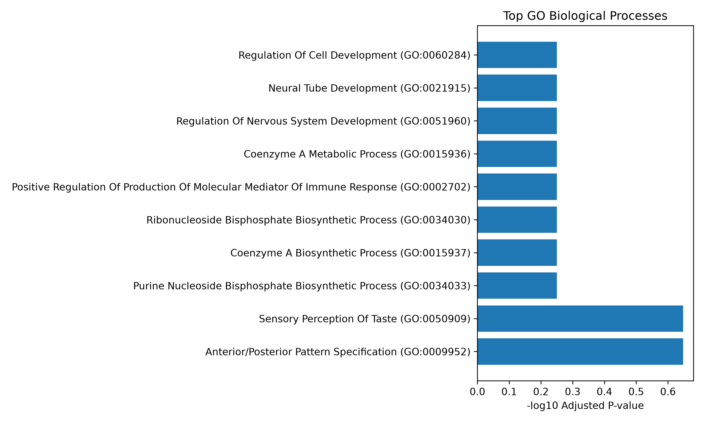
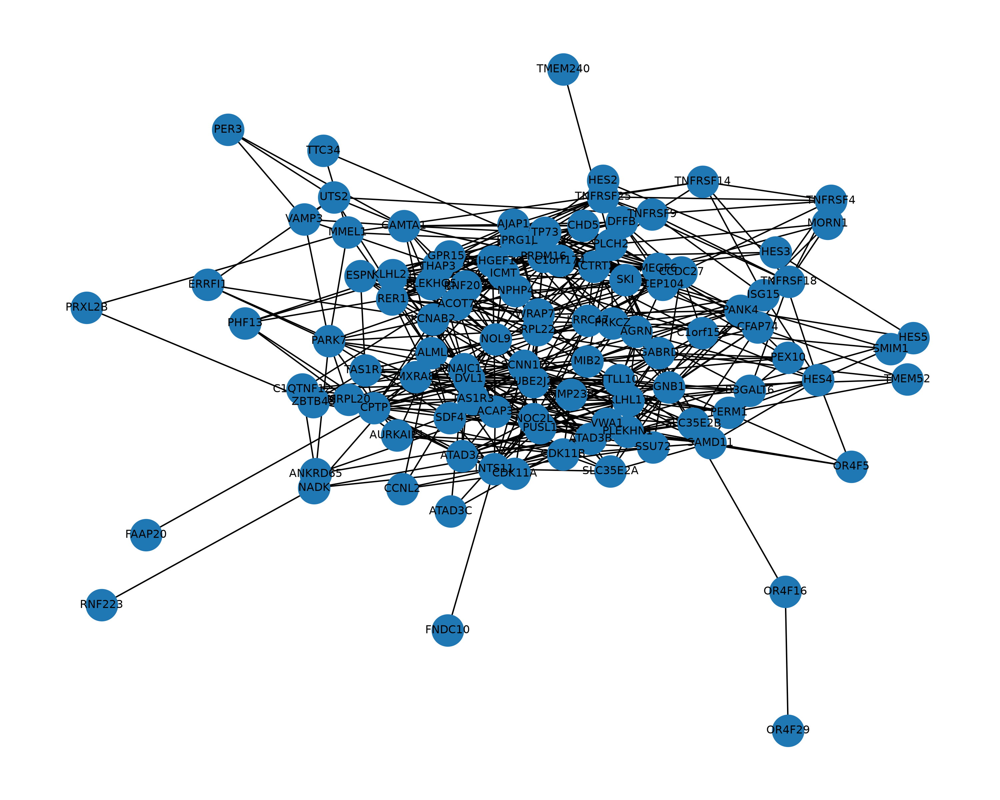

# An End-to-End Python Transcriptomics Pipeline for Alzheimer's Disease Biomarker Discovery

## Overview

This project presents an end-to-end bioinformatics workflow for analysing publicly available RNA-seq transcriptomic data to identify disease-associated genes, biological pathways, and regulatory networks.

The study focuses on Alzheimer's disease transcriptomic changes by comparing human brain samples from Alzheimer's disease patients and healthy controls.

The workflow integrates:

- RNA-seq data preprocessing
- Quality control analysis
- Differential gene expression analysis
- Gene annotation
- Functional enrichment analysis
- Protein-protein interaction network analysis
- Hub gene identification
- Interactive data visualization


## Biological Question

**Which genes and regulatory pathways are altered in Alzheimer's disease compared with healthy brain tissue?**

This project aims to identify candidate biomarkers and biological mechanisms involved in disease progression using computational transcriptomics approaches.


# Dataset

## GEO Accession

**GSE163877**

Source:
NCBI Gene Expression Omnibus (GEO)

Organism:

- Homo sapiens

Tissue:

- Human post-mortem middle temporal gyrus brain tissue

Samples:

- 3 Alzheimer's disease samples
- 4 healthy control samples


The dataset contains simultaneous coding and non-coding RNA sequencing data from Alzheimer's disease and control individuals.


# Analysis Workflow
Public RNA-seq Dataset
|
v
Data Processing
|
v
Quality Control
|
v
Differential Expression Analysis
|
v
Gene Annotation
|
v
GO Biological Process Enrichment
|
v
KEGG Pathway Enrichment
|
v
STRING Protein Interaction Network
|
v
Hub Gene Identification
|
v
Interactive Dashboard


# Methods


## 1. Data Processing

Raw transcriptomic data was processed and converted into an expression matrix suitable for downstream analysis.

Tools:

- Python
- pandas
- numpy


## 2. Quality Control

Quality assessment was performed using:

- Expression distribution analysis
- Log-transformed expression distributions
- Sample correlation analysis
- Principal Component Analysis (PCA)


Generated visualisations:

- Expression distribution plots
- PCA plot
- Sample correlation heatmap


## 3. Differential Expression Analysis

Differential expression was performed between:

- Alzheimer's disease samples
- Healthy control samples

Analysis included:

- Log2 fold change calculation
- Statistical testing
- Multiple testing correction using false discovery rate (FDR)


Outputs:

- Differential expression results
- Ranked gene list
- Candidate significant genes


## 4. Functional Enrichment Analysis

Differentially ranked genes were analysed to identify affected biological pathways.


Analyses performed:

### Gene Ontology (GO)

Identifies biological processes associated with altered gene expression.


### KEGG Pathway Analysis

Identifies molecular pathways involved in disease-associated changes.


## 5. Protein Interaction Network Analysis

STRING database was used to analyse protein-protein interactions between candidate genes.

Network analysis included:

- Interaction network construction
- Degree centrality calculation
- Betweenness centrality analysis


Hub genes were identified as genes with high network connectivity and potential regulatory importance.


# Results


## Differential Expression

The analysis identified genes showing expression differences between Alzheimer's disease and control samples.

Visualisation:

- Volcano plot
- Differential expression heatmap


## Pathway Analysis

Enrichment analysis identified biological processes and molecular pathways associated with Alzheimer's disease-related transcriptional changes.


Generated outputs:

- GO enrichment results
- KEGG pathway results


## Network Analysis

A STRING protein interaction network was constructed to identify highly connected candidate regulatory genes.

Generated outputs:

- Interaction network
- Hub gene ranking


# Interactive Dashboard

A Streamlit dashboard was developed to provide an interactive overview of the transcriptomic analysis workflow.

The dashboard integrates:

- Quality control results
- Principal Component Analysis (PCA)
- Differential expression analysis
- Volcano plot visualisation
- GO pathway enrichment
- Protein interaction network analysis
- Hub gene identification


## Results Visualisation


### Principal Component Analysis (PCA)

PCA was used to evaluate sample separation between Alzheimer's disease and control samples.




### Differential Expression Analysis

The volcano plot highlights genes showing differences in expression between Alzheimer's disease and control samples.




### Functional Enrichment Analysis

GO enrichment analysis identifies biological processes associated with transcriptional changes.




### Protein Interaction Network

STRING-based network analysis was used to identify relationships between candidate genes and potential regulatory hub genes.



## Running the Dashboard

Install requirements:

```bash
pip install -r requirements.txt

run streamlit run src/dashboard.py
```
## Repository Structure 
Transcriptomic-Biomarker-Analysis/

├── data/
│   ├── metadata/
│   ├── processed/
│   └── raw/
│
├── figures/
│   ├── Quality control plots
│   ├── Differential expression plots
│   ├── Enrichment plots
│   └── Network visualisations
│
├── results/
│   ├── Differential expression results
│   ├── Enrichment results
│   ├── STRING network results
│   └── Hub gene analysis
│
├── src/
│   ├── Data processing scripts
│   ├── Statistical analysis scripts
│   ├── Network analysis scripts
│   └── Dashboard application
│
├── requirements.txt
└── README.md

## Technologies Used
Programming
Python
Data Analysis
pandas
numpy
scipy
statsmodels
Bioinformatics
GEO datasets
gseapy
STRING database
mygene
Visualisation
matplotlib
networkx
Streamlit

## Limitations

Due to the small number of available samples in the dataset, this project focuses on exploratory transcriptomic analysis.

Future improvements include:

Implementing DESeq2 or edgeR for RNA-seq differential expression
Increasing sample size through additional datasets
External biomarker validation
Integration with clinical metadata
Machine learning-based biomarker prediction

## Future Extensions

Potential extensions of this project include:

Multi-dataset validation
Survival analysis
Single-cell transcriptomics integration
Machine learning classification models
Drug-target interaction analysis

## Author

Iraaj Gangavaram
